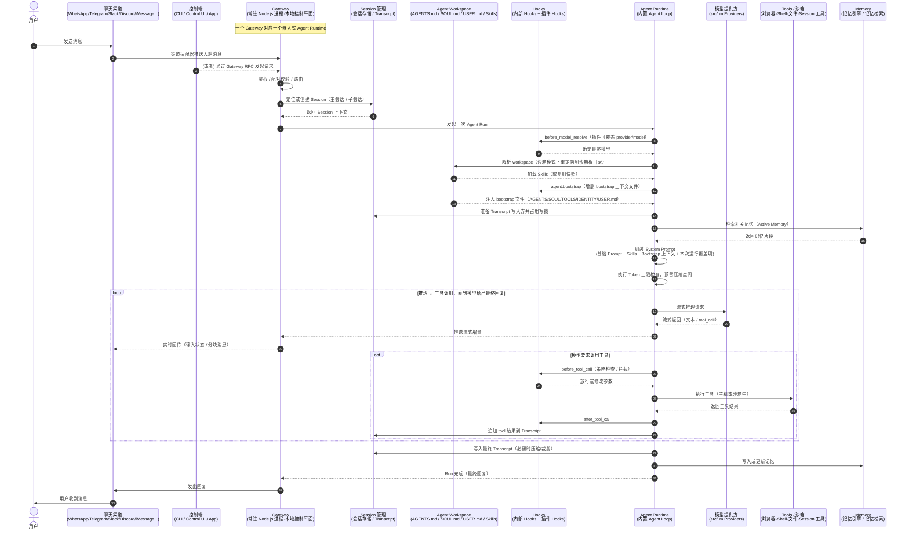

```mermaid
sequenceDiagram
    autonumber
    actor U as 用户
    participant CH as 聊天渠道<br/>(WhatsApp/Telegram/Slack/Discord/iMessage...)
    participant CL as 控制端<br/>(CLI / Control UI / App)
    participant GW as Gateway<br/>(常驻 Node.js 进程·本地控制平面)
    participant SM as Session 管理<br/>(会话存储 / Transcript)
    participant WS as Agent Workspace<br/>(AGENTS.md / SOUL.md / USER.md / Skills)
    participant HK as Hooks<br/>(内部 Hooks + 插件 Hooks)
    participant AR as Agent Runtime<br/>(内置 Agent Loop)
    participant LLM as 模型提供方<br/>(src/llm Providers)
    participant TL as Tools / 沙箱<br/>(浏览器·Shell·文件·Session 工具)
    participant MEM as Memory<br/>(记忆引擎 / 记忆检索)

    Note over GW: 一个 Gateway 对应一个嵌入式 Agent Runtime

    %% ===== 1. 消息接入 =====
    U->>CH: 发送消息
    CH->>GW: 渠道适配器推送入站消息
    CL-->>GW: (或者) 通过 Gateway RPC 发起请求
    GW->>GW: 鉴权 / 配对校验 / 路由
    GW->>SM: 定位或创建 Session（主会话 / 子会话）
    SM-->>GW: 返回 Session 上下文

    %% ===== 2. 会话与工作区准备 =====
    GW->>AR: 发起一次 Agent Run
    AR->>HK: before_model_resolve（插件可覆盖 provider/model）
    HK-->>AR: 确定最终模型
    AR->>WS: 解析 workspace（沙箱模式下重定向到沙箱根目录）
    WS-->>AR: 加载 Skills（或复用快照）
    AR->>HK: agent:bootstrap（增删 bootstrap 上下文文件）
    WS-->>AR: 注入 bootstrap 文件（AGENTS/SOUL/TOOLS/IDENTITY/USER.md）
    AR->>SM: 准备 Transcript 写入方并占用写锁

    %% ===== 3. Prompt 组装 =====
    AR->>MEM: 检索相关记忆（Active Memory）
    MEM-->>AR: 返回记忆片段
    AR->>AR: 组装 System Prompt<br/>(基础 Prompt + Skills + Bootstrap 上下文 + 本次运行覆盖项)
    AR->>AR: 执行 Token 上限检查，预留压缩空间

    %% ===== 4. Agent Loop =====
    loop 推理 ↔ 工具调用，直到模型给出最终回复
        AR->>LLM: 流式推理请求
        LLM-->>AR: 流式返回（文本 / tool_call）
        AR-->>GW: 推送流式增量
        GW-->>CH: 实时回传（输入状态 / 分块消息）
        opt 模型要求调用工具
            AR->>HK: before_tool_call（策略检查 / 拦截）
            HK-->>AR: 放行或修改参数
            AR->>TL: 执行工具（主机或沙箱中）
            TL-->>AR: 返回工具结果
            AR->>HK: after_tool_call
            AR->>SM: 追加 tool 结果到 Transcript
        end
    end

    %% ===== 5. 持久化与收尾 =====
    AR->>SM: 写入最终 Transcript（必要时压缩/裁剪）
    AR->>MEM: 写入或更新记忆
    AR-->>GW: Run 完成（最终回复）
    GW->>CH: 发出回复
    CH->>U: 用户收到消息
```
