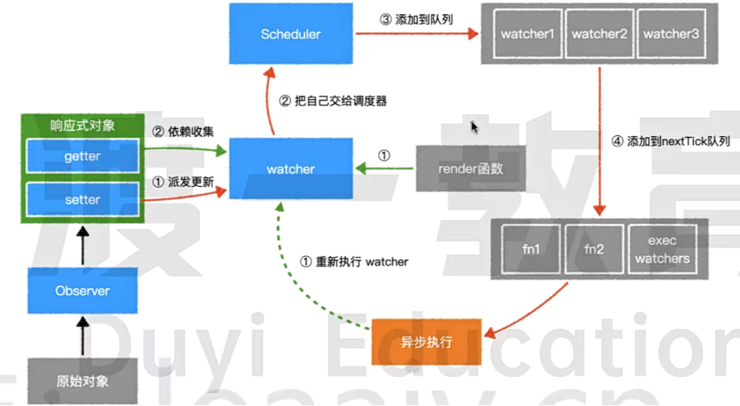

这张图详细描述了 Vue.js（特别是 Vue 2.x 版本）的 **响应式系统原理** 以及 **异步更新队列机制**。

## 第一阶段：初始化与依赖收集

这是组件首次渲染时的流程：

1. 数据劫持 (Observer -> 响应式对象)

   - 左下角的 **原始对象** 经过 **Observer** 处理（在 Vue 2 中是 `Object.defineProperty`，Vue 3 中是 `Proxy`），变成了左上角的 **响应式对象**。

   - 此时，数据的读写操作分别被 **getter** 和 **setter** 拦截。

2. 触发 Getter (绿色 ①)

   - 图中中间灰色的 `render 函数` 开始执行（这是组件渲染的过程）。
     当渲染逻辑读取数据时，触发了 **响应式对象** 的 `getter`。

3. 依赖收集 (绿色 ②)

   - `getter` 此时会把当前正在工作的 `watcher`（中间蓝色的盒子）记录下来。

   - 这建立了一个映射关系：数据 -> 依赖它的 `watcher`。

## 第二阶段：派发更新

这是当数据发生变化时的流程：

1. 触发 Setter (红色 ①)

   - 当我们在代码中修改数据（如 `this.msg = 'hello'`）时，触发 `setter`。

   - `setter` 会通知之前收集到的 `watcher`：“数据变了，你需要更新”。

2. 交给调度器 (红色 ②)

   - 关键点来了：`watcher` 收到通知后，并不会立即执行渲染更新。

   - 相反，它把自己交给了一个叫 `Scheduler` **（调度器）** 的模块。

## 第三阶段：异步调度与批量优化

这是 Vue 性能优化的核心（Event Loop 机制）：

1. 加入队列 (红色 ③)

   - `Scheduler` 维护了一个队列，它会将 **收到的 watcher** 推入这个队列中。

2. 去重优化

   - 如果同一个 `watcher` 被触发了多次，`Scheduler` 只会把这个 watcher 推入队列 **一次** 。

3. 加入 nextTick (红色 ④)

   - 这个队列不会同步执行，而是被放入了 `nextTick 队列`。

   - 这里的 `exec watchers` 就是那个负责清空 `watcher` 队列并执行更新的函数。

   - Vue 内部会利用 `Promise.then` 或 `MutationObserver` 等微任务（Microtask），将这个执行过程延迟到 **当前同步代码执行完毕之后** 。

## 第四阶段：异步执行与闭环

这是视图真正更新的时刻：

1. 异步执行

   - 当主线程的同步代码执行完，浏览器的 **事件循环（Event Loop）** 开始处理 **微任务队列**。

   - 图中右下角的 **异步执行** 模块启动，依次运行队列中的函数。

2. 重新执行 Watcher (绿色虚线 ①)

   - 队列中的 `flushSchedulerQueue 函数`运行，遍历之前缓存的 watcher。
   - watcher 调用自身的 `run` 或 `update` 方法。

3. 回环 (Loop)

   - Watcher 重新调用 render 函数。

   - 生成新的虚拟 DOM，对比差异，更新真实 DOM。

   - 在这个过程中，又会重新触发 `getter`，重新进行依赖收集，为下一次更新做准备。

## 概括

1. 修改数据触发 `Setter`。
2. `Setter` 通知 `Watcher`。
3. `Watcher` 不是立即更新，而是入队 (Scheduler)。
4. 通过 `nextTick` 机制，在当前脚本执行完后，批量清空队列。
5. 最终触发 `Render`，完成视图更新。
