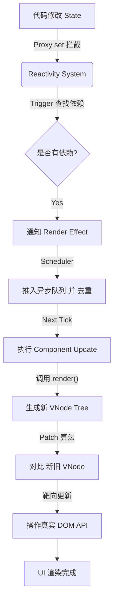

# 状态变化到 UI 渲染流程

1. 响应式系统阶段： 拦截修改，触发通知。

2. 调度器阶段（Scheduler）： 去重与异步缓冲。

3. 渲染与更新阶段（Renderer & Patch）： 生成新蓝图，对比差异，操作真实 DOM。

Vue 3（使用 Proxy）的详细全流程解析（Vue 2 原理类似，仅在拦截方式上不同）：

## 第一阶段：响应式系统的拦截

当你执行 `this.count = 2` 时，并不是直接修改对象属性那么简单，而是触发了 Vue 的响应式。

1. 触发 Setter：

   - 当你赋值时，会触发 Proxy 的 set 拦截器 (handler)。

2. 值比对：

   - Vue 会对比新值和旧值 (Reflect.get)。如果值没有变化（例如从 2 变 2），则直接返回，停止后续流程。

3. 触发依赖：

   - 如果值发生了变化，Proxy 会调用内部的 `trigger(target, key)` 函数。

   - 核心动作： Vue 会去查找一个全局的 `targetMap`（这是一个 WeakMap）。

   - 结构关系：targetMap (对象) -> depsMap (属性) -> dep (Set 集合)。

   - 在这个 dep 集合中，存储着所有依赖于该属性的 **副作用函数 (Effects)**。对于组件来说，这里主要存储的是组件的渲染副作用 (Component Render Effect)。

## 第二阶段：异步调度队列 (The Scheduler)

Vue 不会立即执行渲染。否则会造成巨大的性能灾难。

1. 推入队列 (Queue Job)：

   - 响应式系统找到相关的 **Render Effect** 后，并不会立即执行它的 run 方法，而是调用 `scheduler` 调度器。

   - 调度器将这个 Effect 推入一个全局的 微任务队列 (Microtask Queue) 中。

2. 去重：

   - 这是关键优化。如果同一个 Effect 已经被推入队列（例如你对同一个变量改了两次，或者改了两个不同的变量但它们触发同一个组件更新），调度器会检查 ID，确保同一个组件的更新函数在队列中只存在一次。

3. 异步刷新：

   - 利用 `Promise.resolve().then()` 或 `MutationObserver`，Vue 将队列的刷新操作放到浏览器的 Microtask（微任务）中。

> 这意味着，原本同步的代码执行完（即当前调用栈清空）后，才会开始执行队列中的更新任务。这就是为什么你修改数据后，立即 `console.log` DOM 拿不到新值，而需要用 `nextTick` 的原因。

## 第三阶段：组件渲染与 Patch (The Renderer)

当微任务队列开始刷新，组件的 `update` 逻辑（Render Effect）被触发。

1. 执行渲染函数 (Render Function)：

   - 组件调用其 `render` 函数。

   - 产出： 生成一颗全新的 **虚拟 DOM 树**。

注：此时会 **重新读取 data，因此会重新收集依赖，确保依赖关系的实时性**。

2. Diff 算法 / Patch 过程：

   - Vue 拿到 **新 VNode** 和内存中缓存的 **旧 VNode**，传递给 `patch` 函数进行比对。

   - Vue 3 的优化 (Block Tree & Patch Flags)：

     - Vue 3 编译器在编译模板时，会给 **动态节点** 打上 `Patch Flag`（例如：这个节点只有 Text 变了，或者只有 Class 变了）。

     - 在 Diff 过程中，Vue 可以 **跳过静态节点**，只通过 **Patch Flag 靶向** 更新动态节点，大大提升了 Diff 效率。

   - 核心 Diff 逻辑：

     - 同级比较： 深度优先，同层级比对。

     - 节点复用： 判断 **key** 和 **tag** 是否相同。如果不同，直接销毁旧节点，创建新节点。

     - 最长递增子序列： 如果是列表更新（Array），Vue 3 使用该算法来计算最小移动路径，减少 DOM 元素的移动操作。

3. 真实 DOM 更新：

   - 根据 Patch 的结果，Vue 调用宿主环境的 API（浏览器中即 DOM API）执行具体操作：

     - `node.textContent = 'new text'`

     - `node.setAttribute(...)`

     - `parentElement.appendChild(...)`

4. 生命周期钩子：

   - DOM 更新完成后，触发组件的 `updated` 生命周期钩子。

