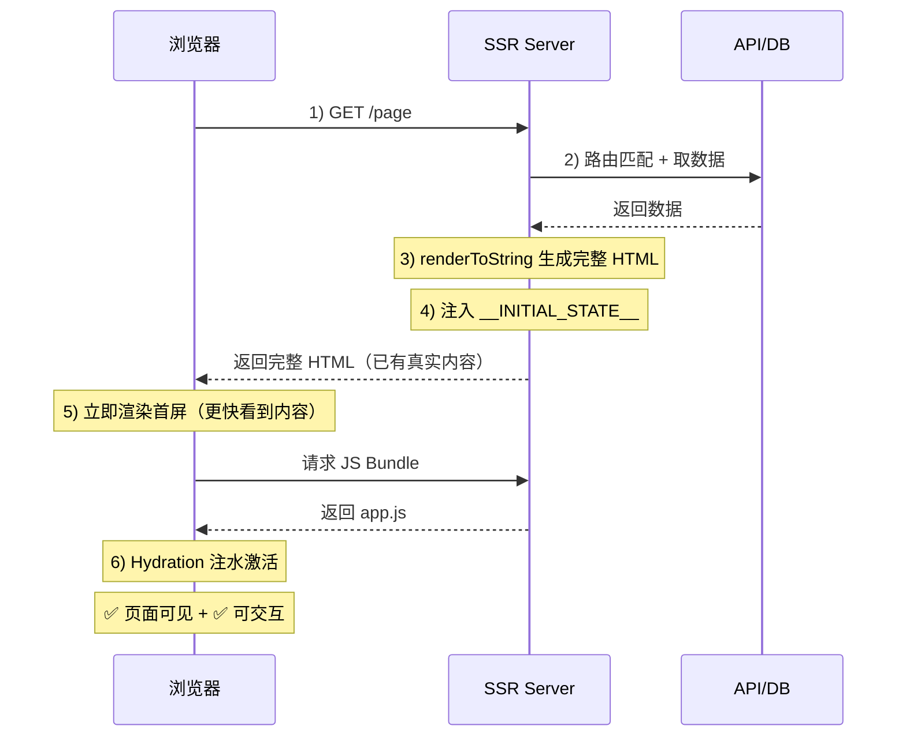
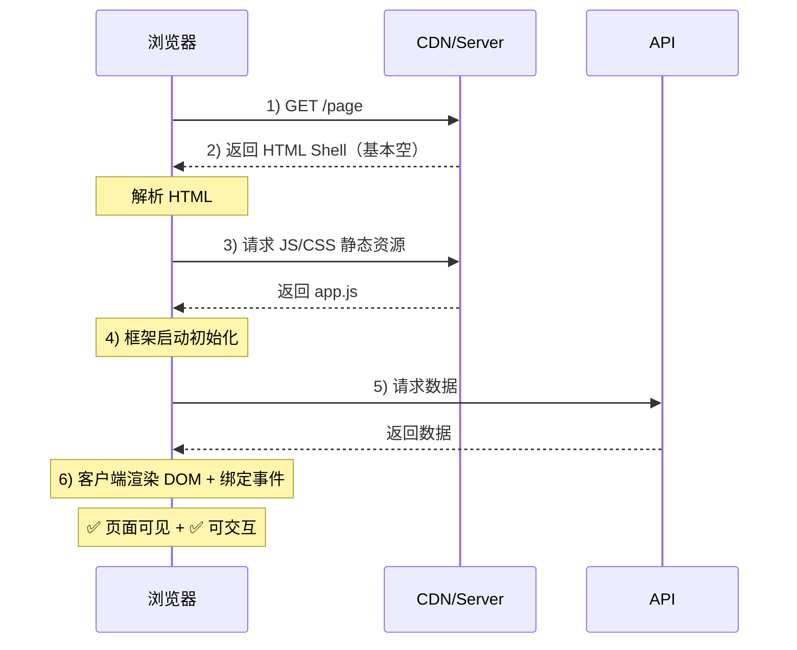

# 前端渲染模式

## 服务端渲染

1. 服务器压力大
2. 首屏加载速度快
3. SEO 优化

### 服务端渲染流程

- SSR 的核心：服务器先把“完整 HTML 内容”渲染好再返回，浏览器拿到 HTML 就能更快看到真实内容；但要“能点能交互”，通常还需要客户端 JS 做 Hydration（注水/激活）

---

### SSR 的整体流程

1. 浏览器发起请求

2. 服务器匹配路由并获取数据

服务器接收到请求后，会根据路由找到对应的页面组件，同时在服务端请求页面需要的数据，例如调用 API 或数据库查询。

3. 服务器执行前端代码生成 HTML

服务器会在 Node.js 环境中执行前端框架代码，通过 SSR API（如 renderToString）把组件渲染成 `完整的 HTML 字符串`。

4. 服务器返回完整 HTML

服务器把生成的 `HTML` 以及必要的 `CSS` 和 `JS bundle` 返回给浏览器。

浏览器拿到 `HTML` 后可以 直接展示页面内容。

5. 客户端 Hydration（页面接管）

浏览器加载客户端 JS 后，前端框架会执行 Hydration（水合）：

- 构建 Virtual DOM
- 与现有 DOM 进行匹配
- 绑定事件
- 恢复组件状态

这样页面就从 静态 HTML 变成 可交互的前端应用。

---

### 为什么需要水合

SSR 在服务端执行代码后，会生成一份 **完整的 HTML 字符串** 返回给浏览器，这样浏览器可以直接显示页面内容，从而提升 **首屏加载速度和 SEO 效果**。

但是服务端渲染出来的 HTML 本质上只是 **静态结构**，里面并没有包含组件的 **事件绑定、状态管理以及前端框架的运行时逻辑**。

因此在浏览器加载到 **客户端 JS bundles** 之后，前端框架会执行 **Hydration（水合）** 过程：

1. 根据组件代码重新构建 `Virtual DOM`
2. 将 `Virtual DOM` 与服务端返回的真实 `DOM` 进行匹配
3. 在不重新渲染 `DOM` 的情况下 给现有 `DOM` 绑定事件和恢复组件状态

这样页面就从一个 可展示的静态 `HTML`，变成了一个 可交互的 `SPA`。

所以总结来说：

1. SSR 解决的是首屏渲染速度和 SEO
2. Hydration 解决的是页面的交互能力

---

## 客户端渲染

### 优点

- 前后端分离
- 服务器压力小
- 交互体验好（SPA）

### 缺点

- 首屏加载速度慢
- 不利于 SEO 优化

### 客户端渲染流程

- CSR 的核心：服务器先返回一个很“空”的 HTML 壳子，真正的页面结构和内容主要由 浏览器下载 JS 后在客户端生成。

---

### 客户端渲染的整体流程

1. 浏览器请求页面

2. 服务器返回一个 基本的 HTML 模板，通常只有一个根节点和 JS 引用，此时页面基本是空的，没有实际内容。

3. 浏览器下载并执行 `JS bundle`。

JS 里面包含：

- 前端框架（React/Vue）
- 页面组件
- 路由逻辑
- 数据请求逻辑

4. JS 渲染页面

JS 在浏览器中运行后：

- 创建 Virtual DOM
- 请求 API 获取数据
- 根据组件生成 DOM
- 挂载到 `#app` 节点

---

## 如何选择？

1. CSR 的交互体验更好，因为它是单页应用，页面切换时只需要在客户端通过 js 更新组件和 DOM，不需要重新请求整个 HTML 页面，因此页面切换更快、体验更接近原生应用。

2. CSR 一般适用于交互复杂、SEO 不重要的场景，比如后台管理系统、数据平台或 Web App。

3. SSR 则适用于首屏加载速度和 SEO 要求较高的场景，比如电商网站、新闻网站或官网等。

## SSG - 静态站点生成

并不在用户请求时生成 HTML，而是在开发者的 **构建阶段** 就把页面全部预渲染成了纯静态的 `.html` 文件。这些静态文件通常会被推送到 CDN 上。

- 优势：

绝对的速度王者： 既有 SSR 的首屏和 SEO 优势，又彻底干掉了服务端的实时计算成本。访问速度等于 CDN 的分发速度。

- 劣势：

极度缺乏动态性。如果内容发生变化（比如博客修改了一个错别字），整个项目必须重新经历漫长的构建和部署过程。不适合高度个性化或实时变动的数据展现。

## ISR - 增量静态再生

同时具备 SSG 的极速首屏和 SSR 的动态数据更新能力。

ISR 允许你在项目发布上线之后，在后台按需生成或更新静态页面，而不需要重新构建整个网站。

### ISR 工作流程

1. 初始构建： 打包时，我们只静态生成最热门的 100 道题的 HTML。剩下的 99,900 道题不打包。

2. 命中缓存： 访客 A 访问热门题，CDN 直接返回静态 HTML，速度极快。

3. 按需生成： 访客 B 访问了一道冷门题（构建时没打包）。服务器会实时阻塞，现场去数据库拉取数据并渲染出这道题的 HTML，返回给访客 B，同时将这个 HTML 存入 CDN 缓存。之后的访客再去访问这道冷门题，就直接走缓存了。

4. 过期与后台静默更新 (Stale-While-Revalidate)： 60 秒过去了，页面缓存被标记为过期。

- 访客 C 在第 61 秒访问该页面。CDN 不会阻塞等待新数据，而是立刻把手里那份过期的旧 HTML 扔给访客 C（保证了极速体验）。

- 与此同时，CDN 会在后台悄悄触发一次 SSR 渲染，去数据库拿最新数据，生成一份全新的 HTML 替换掉旧缓存。

- 访客 D 在第 65 秒访问，拿到的就是全新生成的静态页面了
