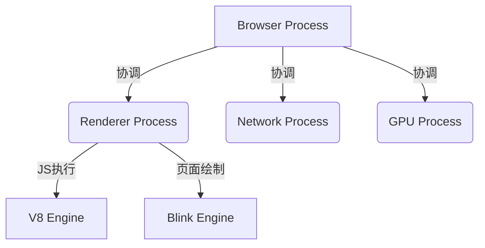

# 浏览器多进程架构

## 进程和线程

进程（Process）是资源分配的最小单位，线程（Thread）是 CPU 调度的最小单位。

| 进程 (Process)                                   | 线程 (Thread)                                  |
| :----------------------------------------------- | :--------------------------------------------- |
| 一个程序至少有一个进程，一个进程至少有一个线程。 | 线程存在于进程内部，是进程的实际执行者。       |
| 拥有独立的内存空间（堆、栈、变量）。             | 共享所属进程的资源（内存、I/O 等）。           |
| 互不影响。一个进程崩溃不会导致其他进程挂掉。     | 同生共死。一个线程崩溃通常会导致整个进程崩溃。 |
| 切换开销大，因为涉及资源重新分配。               | 切换开销小，通信效率高。                       |

## 1. 为什么浏览器需要多进程架构？

早期浏览器是**单进程**的，这意味着页面渲染、JavaScript 执行、网络请求都在同一个进程中。

- **不稳定**：一个插件崩溃或一个 Tab 卡死，会导致整个浏览器崩溃。
- **不流畅**：JS 执行繁重任务会阻塞页面渲染。
- **不安全**：恶意代码可以轻易获取系统权限。

**现代多进程架构的优点**：

- **稳定性**：进程间隔离，Tab 崩溃不会影响其他 Tab。
- **流畅性**：脚本阻塞通常只影响当前页面。
- **安全性**：沙箱机制（Sandbox）限制了渲染进程对系统的访问权限。

## 2. Chrome 核心进程解析

Chrome 主要由以下几类进程组成：

### 2.1 浏览器主进程 (Browser Process)

- **职责**：浏览器的“管家”。
- 负责界面显示（地址栏、书签、前进后退）。
- 负责用户交互（点击、滚动）。
- 负责子进程管理（创建和销毁渲染进程）。
- 提供存储功能（Cookie, LocalStorage）。

### 2.2 渲染进程 (Renderer Process)

- **职责**：将 HTML、CSS 和 JavaScript 转化为用户可见的页面。
- **核心**：默认情况下，Chrome 会为每个 Tab 开启一个独立的渲染进程（Process-per-tab 模式，但在资源不足时可能会合并）。
- **包含**：Blink 渲染引擎、V8 JS 引擎。
- **沙箱运行**：不能读写硬盘，不能随意访问操作系统。

### 2.3 GPU 进程 (GPU Process)

- **职责**：负责 UI 界面的绘制和 CSS3 动画等硬件加速。
- 最初是为了加速 3D CSS，后来也负责网页和浏览器 UI 的合成。

### 2.4 网络进程 (Network Process)

- **职责**：负责页面的网络资源加载（HTML, CSS, JS, 图片等）。

### 2.5 插件进程 (Plugin Process)

- **职责**：负责插件（如 Flash，现已淘汰）的运行。
- 严格隔离，防止插件崩溃导致浏览器崩溃。

## 3. 渲染进程中的核心线程 (重点)

渲染进程内部是**多线程**的，这是前端开发最直接相关的部分。

| 线程名称           | 职责                                     | 关键点                                                                 |
| :----------------- | :--------------------------------------- | :--------------------------------------------------------------------- |
| **GUI 渲染线程**   | 解析 HTML/CSS，构建 DOM 树，布局和绘制。 | **与 JS 引擎线程互斥**。当 JS 执行时，GUI 渲染会被挂起，导致页面卡顿。 |
| **JS 引擎线程**    | 处理 JavaScript 脚本（如 V8 引擎）。     | **单线程运行**。同一时间只能执行一个任务。                             |
| **事件触发线程**   | 控制事件循环（Event Loop）。             | 当事件（点击、请求完成）触发时，将其放入任务队列等待 JS 引擎处理。     |
| **定时器触发线程** | 处理 `setTimeout` 和 `setInterval`。     | 计时完毕后，将回调放入任务队列。                                       |
| **异步 HTTP 线程** | 处理 XMLHttpRequest / Fetch 请求。       | 请求状态变更时，将回调放入任务队列。                                   |

## 4. 面试高频问答

### Q1: 为什么 JavaScript 是单线程的？

> 如果 JS 是多线程的，一个线程在 DOM 节点上添加内容，另一个线程删除了该节点，浏览器该听谁的？为了避免复杂的同步问题，JS 从诞生起就是单线程的。虽然现在有了 **Web Worker**，但它受主线程控制，且**不能操作 DOM**，所以没有改变 JS 单线程操作 DOM 的本质。

### Q2: 既然是多进程，为什么开很多 Tab 会占很大内存？

> 因为每个进程都有独立的内存空间（包含独立的 V8 实例、DOM 缓存等）。虽然 Chrome 有优化机制（如多个空闲 Tab 共用进程），但在追求独立性和安全性的架构下，内存消耗是换取稳定性的代价。

### Q3: 在浏览器地址栏输入 URL 到页面展示，涉及哪些进程？

1.  **Browser 进程**：接收用户输入，组装请求，转发给网络进程。
2.  **Network 进程**：发起请求，接收响应头，如果 Content-Type 是 html，通知 Browser 进程。
3.  **Browser 进程**：寻找或创建**渲染进程**，发送“提交导航”消息。
4.  **Renderer 进程**：接收文档，开始解析和渲染（加载子资源可能再次调用网络进程）。
5.  **GPU 进程**：辅助最终的页面绘制和合成。

## 5. 总结图示

