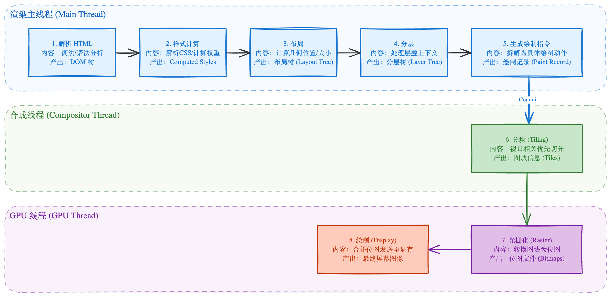

# 浏览器渲染进程与原理

## 渲染流程详解

整个渲染过程可以分为以下几个阶段：

### 1. 构建对象模型

- **DOM (Document Object Model) 构建**：
  - **字节 -> 字符 -> 令牌 (Tokens) -> 节点 (Nodes) -> DOM 树**。
  - 浏览器遇到 HTML 标签时，将其解析为 DOM 节点。
  - 遇到 `<script>` 标签会阻塞解析（除非有 `async` 或 `defer`）。
- **CSSOM (CSS Object Model) 构建**：
  - 解析 CSS 文件和 `<style>` 标签，构建 CSSOM 树。
  - CSS 解析会阻塞渲染（Render Blocking），因为没有样式无法正确绘制页面。

### 2. 构建渲染树

- 浏览器将 DOM 树和 CSSOM 树合并成 **Render Tree**。
- **关键点**：
  - `display: none` 的节点**不会**出现在渲染树中。
  - `visibility: hidden` 的节点**会**出现在渲染树中（因为它占据空间）。
  - `<head>` 等不可见标签不包含在内。

### 3. 布局 (Layout) / 重排 (Reflow)

- 计算渲染树中每个节点在屏幕上的**确切坐标和大小**。
- 从根节点开始遍历，由于节点之间存在层级和依赖关系，布局通常是同步进行的。
- **输出**：盒模型（Box Model）的具体度量。

### 4. 绘制 (Paint)

- 将计算好的布局绘制成像素点。
- 包括：填充颜色、文本、边框、阴影等。
- **绘制列表**：绘制并不是一次性完成的，而是生成一系列绘制指令。

### 5. 合成 (Compositing)

- 现代浏览器为了优化性能，将页面分成多个**图层 (Layers)** 独立栅格化。
- **合成线程 (Compositor Thread)** 接收这些图层，并将它们组合成最终的屏幕图像。
- **GPU 加速**：`transform` 和 `opacity` 等属性可以在合成线程处理，不触发主线程的布局和绘制，性能极高。

## 面试高频考点

### 1. 回流 (Reflow)

- **定义**：当元素的位置、尺寸、布局发生变化时，浏览器需要重新计算布局。
- **触发条件**：
  - 添加/删除可见的 DOM 元素。
  - 改变元素尺寸（margin, padding, border, width, height）。
  - 内容改变（如 input 输入文字，文本行数变化）。
  - 浏览器窗口大小改变 (resize)。
  - 获取某些属性（强制同步布局）：`offsetWidth`, `scrollTop`, `getComputedStyle()`。

    > 当你在 JavaScript 中读取某些几何属性时，浏览器会被迫立即执行布局计算，以便返回最新的准确值

- **影响**：成本很高，因为回流通常会引起重绘。

### 2. 重绘 (Repaint)

- **定义**：当元素的外观发生改变，但**不影响布局**时。
- **触发条件**：
  - `color`, `background-color`, `visibility`。
- **影响**：成本较回流低。

> **结论**：**回流必将引起重绘，而重绘不一定会引起回流。**

## 优化策略 (性能优化)

1.  **减少回流/重绘范围**：
    - 尽量在低层级的 DOM 节点上操作。

    - 不要使用 `table` 布局（牵一发而动全身）。

2.  **减少回流/重绘次数**：
    - **样式集中改变**：修改 `class` 而不是多次修改 `style` 属性。

    - **离线操作 DOM**：使用 `documentFragment`，或者先 `display: none` 操作完再显示。
    - **读写分离**：避免在循环中交替读取布局属性（如 `offsetWidth`）和修改样式（这会导致**强制同步布局 Layout Thrashing**）。

    ```js
    // ❌ 糟糕的写法 - 每次循环都触发强制布局
    for (let i = 0; i < elements.length; i++) {
      elements[i].style.width = container.offsetWidth + "px"; // 读 → 强制布局
    }

    // ✅ 正确的写法 - 先读后写
    const width = container.offsetWidth; // 只触发一次
    for (let i = 0; i < elements.length; i++) {
      elements[i].style.width = width + "px";
    }
    ```

3.  **利用 GPU 加速 (合成层)**：
    - 使用 `transform` 代替 `top/left` 做动画。
    - 使用 `will-change` 属性（适度使用）。

## 总结

| 阶段            | 描述                      | 关键线程          | 优化建议                          |
| :-------------- | :------------------------ | :---------------- | :-------------------------------- |
| **Parsing**     | HTML -> DOM, CSS -> CSSOM | 主线程            | 减少 DOM 深度，非阻塞加载 CSS/JS  |
| **Render Tree** | 合并 DOM & CSSOM          | 主线程            | 减少选择器复杂度                  |
| **Layout**      | 计算几何信息              | 主线程            | **避免强制同步布局**，减少回流    |
| **Paint**       | 绘制像素                  | 主线程/光栅化线程 | 减少绘制区域                      |
| **Composite**   | 图层合成                  | 合成线程 (GPU)    | **使用 transform/opacity 做动画** |


