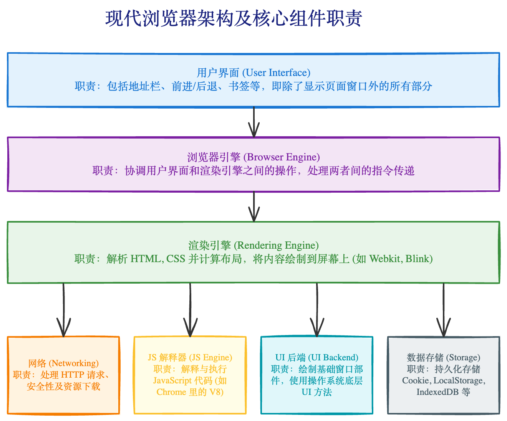

# 现代浏览器组成与核心组件 (Browser Components)

## 1. 浏览器的 7 大核心组件

### 1.1 用户界面 (User Interface)

- **职责**：除了网页显示的主窗口之外的所有可见部分。
- **包括**：地址栏、前进/后退按钮、书签菜单、刷新按钮等。
- **交互**：用户与浏览器壳子（Shell）的直接交互层。

### 1.2 浏览器引擎 (Browser Engine)

- **职责**：作为 **用户界面** 和 **渲染引擎** 之间的桥梁（中间件）。
- **功能**：在 UI 和渲染引擎之间 **传送指令**。例如，当用户点击“刷新”按钮时，浏览器引擎会捕获该指令并通知渲染引擎重新加载页面。
- **接口**：提供操作渲染引擎的高级接口 (Data Persi stence 接口等)。

### 1.3 渲染引擎 (Rendering Engine) —— **最核心**

- **职责**：负责显示请求的内容。
- **流程**：解析 HTML 和 CSS -> 构建 DOM/CSSOM -> 构建渲染树 -> 布局 -> 绘制。
- **常见引擎**：
  - **Blink** (Chrome, Edge, Opera) - fork 自 Webkit。
  - **Webkit** (Safari)。
  - **Gecko** (Firefox)。

### 1.4 网络 (Networking)

- **职责**：负责网络调用，如 HTTP 请求。
- **功能**：处理 DNS 解析、建立 TCP 连接、TLS 握手、HTTP 缓存策略等。
- **特点**：通常是平台无关的接口，底层实现因操作系统而异。

### 1.5 UI 后端 (UI Backend)

- **职责**：用于绘制基本的窗口小部件（Widgets），如组合框、输入框、窗口边框。
- **特点**：它不直接绘制具体的网页 UI，而是暴露通用的绘图接口，底层使用操作系统的用户界面方法（如 Windows 的 GDI/DirectX，macOS 的 Quartz）。

### 1.6 JavaScript 解释器 (JavaScript Interpreter)

- **职责**：解析和执行 JavaScript 代码。
- **交互**：执行结果通常会调用渲染引擎的接口（DOM API）来修改页面。
- **常见引擎**：
  - **V8** (Chrome, Node.js)。
  - **SpiderMonkey** (Firefox)。
  - **JavaScriptCore** (Safari)。

### 1.7 数据存储 (Data Persistence)

- **职责**：浏览器需要在硬盘上保存各种数据。
- **类型**：
  - **Cookie**：传统的会话存储。
  - **Web Storage**：LocalStorage (持久), SessionStorage (会话)。
  - **IndexedDB**：类似于 NoSQL 的大型数据库。
  - **FileSystem**：文件系统访问（部分浏览器支持）。
  - **Cache**：资源缓存。

---

## 2. 组件之间的协作（以打开网页为例）

1.  **UI** 接收用户输入的 URL，传给 **浏览器引擎**。
2.  **浏览器引擎** 调用 **网络组件** 发起 URL 请求。
3.  **网络组件** 获取到 HTML 响应，传递给 **渲染引擎**。
4.  **渲染引擎** 开始解析 HTML，遇到 `<script>` 标签时请求 **JS 解释器** 处理。
5.  **渲染引擎** 在解析过程中可能需要向 **UI 后端** 请求绘制基础控件，或访问 **数据存储** 读取 Cookie。
6.  最终 **渲染引擎** 将绘制好的位图显示在 **UI** 的内容区域。

---

## 3. 现代架构与组件的关系

虽然逻辑上分为这 7 大组件，但在 **现代 Chrome 架构（多进程）** 中，它们的归属如下：

| 逻辑组件             | 归属的进程 (Chrome)             |
| :------------------- | :------------------------------ |
| **User Interface**   | Browser Process (主进程)        |
| **Browser Engine**   | Browser Process (主进程)        |
| **Rendering Engine** | **Renderer Process** (渲染进程) |
| **JS Interpreter**   | **Renderer Process** (渲染进程) |
| **Networking**       | Network Process (网络进程)      |
| **UI Backend**       | GPU Process / Browser Process   |
| **Data Persistence** | Browser Process (管理)          |

## 4. 总结

面试时建议先回答 **7 大组件** 的逻辑划分，展示你对浏览器功能模块的完整认知；然后补充说明在 **现代多进程架构** 下，这些组件是如何分布在不同进程中运行的（重点强调渲染引擎和 JS 引擎在渲染进程中），这样可以体现深度。

