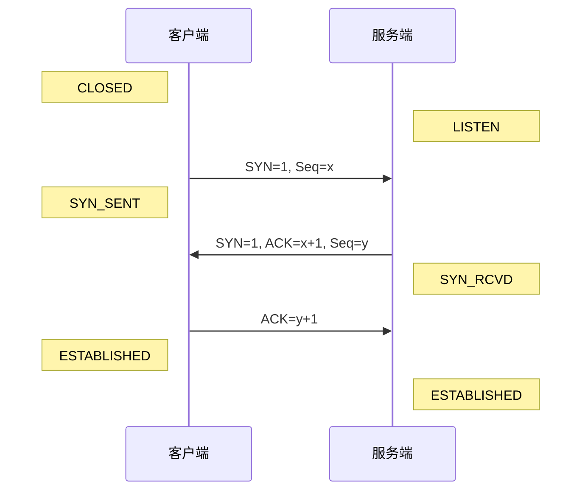
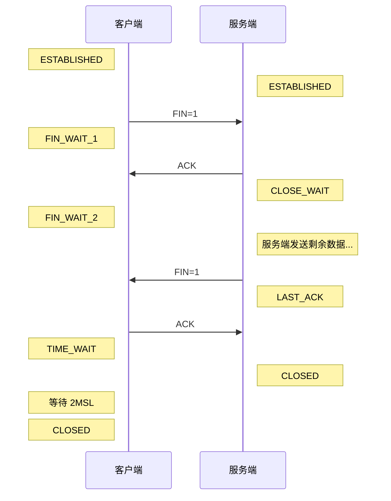

# TCP

TCP 是传输层协议，它为应用层提供了一种可靠的、面向连接的、字节流的传输服务。

- 核心特性
- 连接管理（三次握手与四次挥手）
- 以及可靠性保障机制

## 连接管理

### 三次握手 (建立连接)

目的是确认双方的发送能力和接收能力都正常，并同步初始序列号 (ISN)。

#### 流程：

1. SYN：客户端发送 SYN=1, Seq=x。客户端进入 `SYN_SENT` 状态。（客户端：我想连接）。

2. SYN + ACK：服务端收到后，发送 SYN=1, ACK=x+1, Seq=y。服务端进入 `SYN_RCVD` 状态。（服务端：收到了，我也想连接）。

3. ACK：客户端收到后，发送 ACK=y+1。客户端进入 `ESTABLISHED` 状态，服务端收到后也进入 `ESTABLISHED` 状态。（客户端：好的，连接建立）。

#### 为什么是三次？

1. 防止历史连接初始化：如果是两次，一个失效的旧连接请求突然到达服务端，服务端直接建立连接，会浪费资源。三次握手允许客户端在收到服务端响应后检查序列号，如果是旧连接则发送 RST 拒绝。

2. 确认双向能力：
   1. 第一次：服务端确认（客户端发正常，服务端收正常）。
   2. 第二次：客户端确认（服务端发、收正常；客户端发、收正常）。
   3. 第三次：服务端确认（客户端收、发正常）。

### 四次挥手 (断开连接)

由于 TCP 是全双工的，发送方和接收方都需要单独关闭自己的发送通道。

#### 流程：

1. **第一次挥手 (FIN)**:
   - **客户端**: 发送 FIN=1，Seq=u。进入 `FIN_WAIT_1` 状态。
   - **含义**: 客户端说：“我没有数据要发了，请求断开”。

2. **第二次挥手 (ACK)**:
   - **服务端**: 收到 FIN，发送 ACK=1，Seq=v，ack=u+1。进入 `CLOSE_WAIT` 状态。
   - **客户端**: 收到 ACK 后，进入 `FIN_WAIT_2` 状态。
   - **含义**: 服务端说：“好的，我知道了，但我可能还有数据没传完，你先等等”。
   - **注意**: 此时连接处于 **半关闭 (Half-Close)** 状态。客户端无法发送数据，但仍可接收服务端的数据。

3. **第三次挥手 (FIN)**:
   - **服务端**: 数据发送完毕后，发送 FIN=1，ACK=1，Seq=w，ack=u+1。进入 `LAST_ACK` 状态。
   - **含义**: 服务端说：“我的数据也发完了，可以断开了”。

4. **第四次挥手 (ACK)**:
   - **客户端**: 收到 FIN，发送 ACK=1，Seq=u+1，ack=w+1。进入 `TIME_WAIT` 状态。
   - **服务端**: 收到 ACK 后，进入 `CLOSED` 状态，连接结束。
   - **客户端**: 等待 **2MSL** 后，自动进入 `CLOSED` 状态。
   - **含义**: 客户端说：“收到，拜拜”。

#### 为什么是四次？

1. 因为服务端收到 FIN 时，可能还有数据未处理完，不能立刻关闭连接，所以先回一个 ACK 表示“收到”，等处理完了再发 FIN 表示“可以关闭”。

#### 为什么有 TIME_WAIT (2MSL)？

1. 确保最后一个 ACK 能到达服务端：如果最后一个 ACK 丢了，服务端会重传 FIN，客户端需要在 2MSL 内能再次收到并回复 ACK。

2. 防止旧报文干扰：等待 2MSL 可以让网络中残留的旧报文段全部过期消失，防止影响新连接。

## TCP vs UDP

核心区别 (对比表)
特性 TCP (Transmission Control Protocol) UDP (User Datagram Protocol)
连接性 面向连接 (需要三次握手建立连接)。 无连接 (想发就发，直接扔出去)。
可靠性 可靠。保证数据不丢失、不重复、按序到达 (有重传机制)。 不可靠。尽最大努力交付，丢包了也不管。
传输效率 慢。首部开销大 (20字节)，机制复杂 (拥塞控制)。 快。首部开销小 (8字节)，无拥塞控制。
数据流 面向字节流 (像流水一样，可能粘包)。 面向报文 (发一个包收一个包，边界清晰)。
应用场景 网页 (HTTP)、邮件 (SMTP)、文件传输 (FTP)。 直播、视频会议、在线游戏 (FPS)、DNS。
