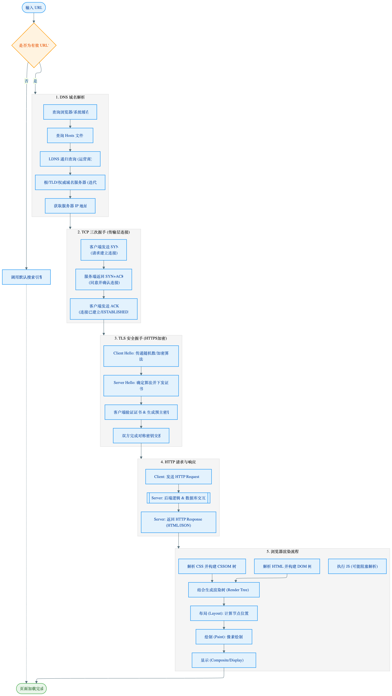

# 输入 URL 后发生了什么

## 第一阶段：网络请求过程

### 1. URL 解析与缓存检查

- **输入检查**：浏览器判断输入的是合法 URL 还是搜索关键词。

- **HSTS 检查**：如果网站开启了 HSTS（HTTP Strict Transport Security HTTP 严格传输安全），浏览器会强制将 HTTP 重定向为 HTTPS。

  ```http
  Strict-Transport-Security: max-age=31536000; includeSubDomains; preload
  ```

  > 在接下来的一年内访问这个域名（以及子域名）时，浏览器都会自动将 HTTP 请求重定向为 HTTPS。

- **检查强缓存**：浏览器首先检查本地是否有有效的强缓存（Cache-Control / Expires）。
  - 如果有且未过期，直接从内存或磁盘读取资源，不发送网络请求（状态码 200 OK (from disk cache)）。

  - 如果没有或已过期，进入下一步。

### 2. DNS 解析

如果缓存未命中，需要进行 DNS 查询。查找过程遵循就近原则：

1. 递归查询
   - **浏览器缓存**：检查浏览器自身的 DNS 缓存。

   - **操作系统缓存**：检查系统 hosts 文件或 OS 缓存。

   - **路由器缓存**：检查路由器 DNS 记录。

   - **ISP DNS 缓存**：向运营商的 DNS 服务器查询。

2. 迭代查询
   - **递归查询**：如果都没找到，ISP DNS 会按照 **根/顶级/权威服务器** 的顺序查询（Root -> .com -> google.com），直到获取目标 IP。

### 3. 建立 TCP 连接 (三次握手)

拿到 IP 后，浏览器与服务器建立可靠连接：

- **三次握手**：
  - 客户端发 SYN。
  - 服务端回 SYN + ACK。
  - 客户端回 ACK。
- **TLS/SSL 握手** (如果是 HTTPS)：
  - 在 TCP 握手之后，还需要进行 TLS 握手来交换密钥，确保通信加密。
  - 涉及流程：Client Hello -> Server Hello (下发证书) -> 验证证书 -> 生成会话密钥 -> 加密通信。

### 4. 发送 HTTP 请求

连接建立后，浏览器构建并发送请求报文：

- **请求行**：方法（GET）、URL、协议版本。
- **请求头**：携带 Cookie、User-Agent、Accept-Encoding 等。
- **请求体**：POST 请求的数据。
- **注意**：如果之前有协商缓存（ETag / Last-Modified），会在 Header 中带上 If-None-Match 或 If-Modified-Since。

### 5. 服务器处理与响应

- **负载均衡**：请求可能先到达 Nginx/LVS，被分发到具体的应用服务器。
- **后端处理**：服务器解析请求，查询数据库，处理业务逻辑。
- **返回响应**：
  - **304 Not Modified**：如果命中协商缓存，只返回头部，不返回 Body，告诉浏览器用本地缓存。
  - **200 OK**：返回完整的 HTML 数据。

## 第二阶段：页面渲染过程 (关键渲染路径)

当浏览器拿到响应的 HTML 数据流后，渲染引擎开始工作：

### 6. 解析 (Parsing)

- **构建 DOM 树**：词法分析 -> 语法分析，将 HTML 标记转化为 DOM 节点。
- **构建 CSSOM 树**：解析 CSS 文件和 `<style>` 内容，计算样式优先级。
- **JS 执行**：
  - 遇到 `<script>` 默认会阻塞 DOM 解析。
  - `defer`：延迟到 HTML 解析完执行。
  - `async`：下载完立即执行（可能阻塞 HTML 解析）。

### 7. 渲染 (Rendering)

- **构建渲染树 (Render Tree)**：将 DOM 树和 CSSOM 树合并。
- **注意**：`display: none` 的节点不会进入渲染树，但 `visibility: hidden` 会。
- **布局 (Layout/Reflow)**：计算每个节点在屏幕上的确切位置和大小（回流）。
- **绘制 (Painting/Repaint)**：填充像素，如颜色、背景、阴影（重绘）。
- **合成 (Composite)**：将不同的图层（Layer）分别光栅化，通过 GPU 合成并在屏幕上显示。

### 8. 断开连接 (四次挥手)

- 如果 HTTP 头部开启了 `Connection: keep-alive`（HTTP/1.1 默认开启），TCP 连接会保持一段时间以便复用。
- 否则，执行四次挥手断开连接。

## 加分项

### Chrome 多进程架构与 IPC 通信

#### 进程分工详解

- 浏览器进程：主控进程，负责界面显示（地址栏、书签）、用户交互、子进程管理。它协调“输入 URL”的开始。

- 网络进程：独立负责网络资源加载。它与浏览器进程通过 IPC (Inter-Process Communication) 通信。当它收到 HTML 头部的 Content-Type: text/html 后，会通知浏览器进程，浏览器进程再通知渲染进程“准备接收数据”。

- 渲染进程：核心！负责 HTML/CSS/JS 解析和页面渲染。每个标签页通常对应一个独立的渲染进程（Process-per-site-instance），这保证了 Tab 之间的沙箱隔离（一个页面崩溃不会带崩整个浏览器）。

- GPU 进程：负责 CSS3 动画、Canvas 绘制等硬件加速任务。

#### 从网络到渲染的“提交文档”

- 网络进程下载好数据后，不会直接给渲染进程。
  - 流程：
    - 浏览器进程收到网络进程的响应头
    - 浏览器进程向渲染进程发起“提交文档”消息
    - 渲染进程与网络进程建立数据管道接收 HTML
    - 渲染进程确认提交
    - 浏览器更新地址栏状态和安全指示符

### 预加载扫描器 (Preload Scanner)

并行处理与关键资源加载优化。

- 原理：传统的 HTML 解析是串行且阻塞的。
  - 当主线程遇到 `<script>` 标签时，必须暂停 DOM 解析，下载并执行脚本（因为脚本可能修改 DOM，如 document.write）。

- 预加载扫描器是一个独立于主解析线程的轻量级解析器。它会快速“扫视”原始 HTML 字节流，寻找 `<link rel="stylesheet">`、`<script src="...">`、`` 等外部资源。

- 作用：它会在主线程被 JS 阻塞时，利用空闲的网络线程并行下载这些后续需要的资源。

- 面试应用：这解释了为什么将 CSS 放在 `<head>` 里、JS 放在 `<body>` 底部是最佳实践，同时也解释了为什么现在的浏览器即使 JS 阻塞了 DOM，图片和 CSS 依然能快速下载。

- 开发者启示：不要通过 JS 动态生成关键资源的 URL（如 document.createElement('script')），因为扫描器看不懂 JS 逻辑，无法提前发现这些资源，导致加载延迟。

### HTTP 版本演进与队头阻塞 (Head-of-Line Blocking)

传输层与应用层的瓶颈转移。

1. HTTP/1.1 的阻塞 (HTTP HOL)：

   现象：浏览器限制每个域名通常只能建立 6 个 TCP 连接。如果一个请求处理慢，后续请求只能排队。

   补救：域名分片（Domain Sharding）、雪碧图、合并文件都是为了绕过这个限制。

2. HTTP/2 的多路复用 (Multiplexing) 与 TCP 阻塞：

   原理：引入 **二进制分帧层**，将数据拆分为 **Frame**，每个 **Frame** 带 **Stream ID**。所有请求可以在同一个 TCP 连接上乱序发送，接收端根据 ID 组装。解决了 HTTP 层的队头阻塞。

   新问题 (TCP HOL)：虽然应用层不阻塞了，但底层 TCP 协议要求数据按序到达。如果 TCP 丢了一个包，操作系统会等待重传，暂停将后续收到的包交给应用层。因此，在丢包率高的网络环境下，HTTP/2 甚至可能比 HTTP/1.1 更慢。

3. HTTP/3 (QUIC) 的颠覆：

   **基于 UDP**：UDP 不需要按序，也不管丢包。QUIC 在 UDP 之上自己实现了可靠传输。

   **独立流**：QUIC 的流（Stream）之间是独立的。Stream A 丢包，只会阻塞 Stream A，Stream B 照样传输。彻底解决了 TCP 队头阻塞。

   **连接迁移**：基于 Connection ID 而不是 IP:Port。手机从 WiFi 切换到 4G，IP 变了，但 Connection ID 没变，连接无需重新握手，无缝切换。

## 流程图


